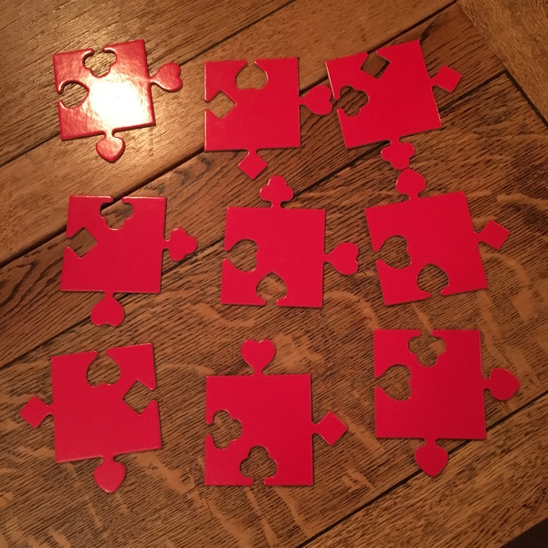

# Logic Jigsaw - Solving a Jigsaw puzzle

...with a Logic monad. Written for October
2016's
[West London Hack Night](http://www.meetup.com/West-London-Hack-Night/).

On my laptop it solves and prints in about 0.09s, which isn't too shabby!

## Puzzle

Put these tiles together in a 3x3 grid. There is one solution. (Well, four
if you allow rotations.)



## Building & Running

``` sh
stack build
stack exec logic-jigsaw
```
